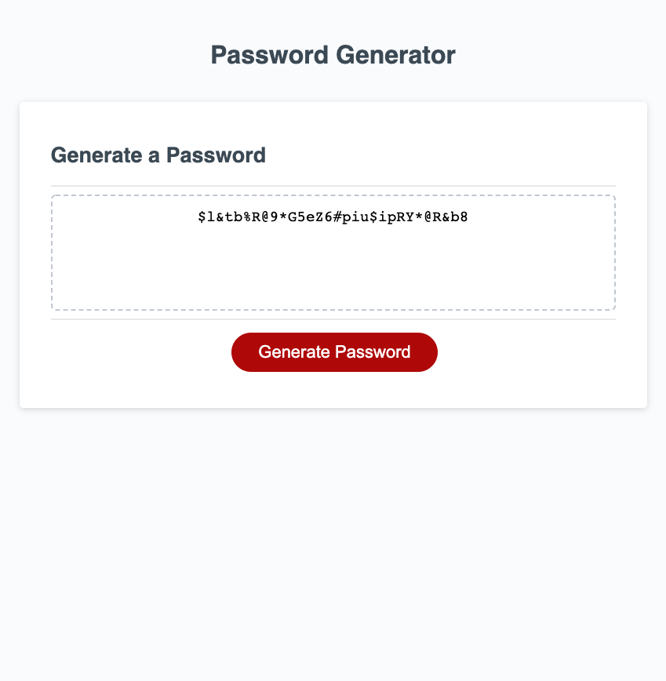

# Password-Generator

## [Password Generator](https://josiemald.github.io/password-generator/)

## [Repository](https://github.com/JosieMald/password-generator)



### Project:
```
Client requests a site to randomly generate a password that meets certain criteria to create a strong password that provides greater security.
```

### Description
```
A password generator that asks for requirements of the users choice which include lowercase, uppercase, numeric, and/or special characters. Once all the requirements are met the user is given a secure password with the requirements they selected.
```